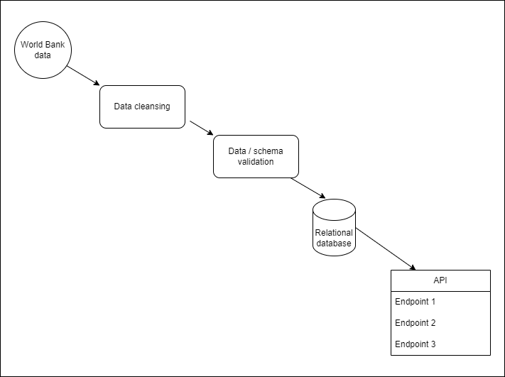
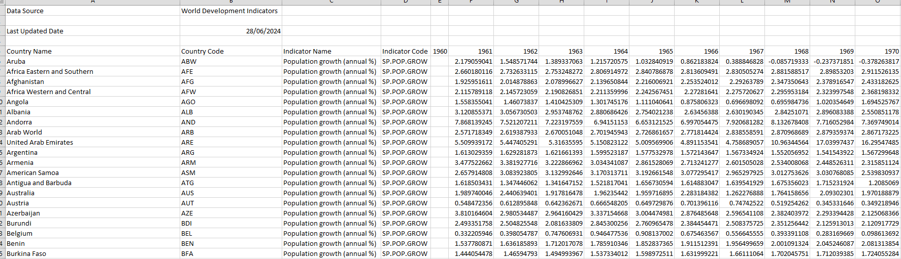
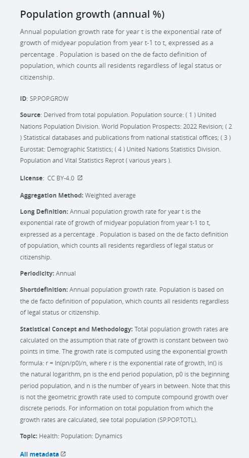

# Project Title: Global data analysis API
Data Analytics Boot Camp - Project 3

Slides: https://docs.google.com/presentation/d/1QuK3O8G-P0fPEqNZbSi0aKoBhZVnk_J-3CgCmaurGuE/edit?usp=sharing

## Team members (Group 6)
Kenneth Le, Kurai Monica Matiki, Eric Tran, Greg Presneill

## Project Overview and Rationale
This project aims to provide a reliable, scalable API solution that supports analysts investigating global data statistics and trends over time.

The initial dataset focuses on world population growth. Understanding global population growth is crucial for policy making, economic planning, and resource management. By analysing population data, we help governments, organisations, and researchers to draw insights and make data-driven decisions.

Analysts could use the data to explore questions such as:
1. How has the global population growth rate changed over the past decade?
2. What are the trends in population growth across different continents and countries?
3. Which regions are experiencing the highest and lowest growth rates?
4. How do demographic factors such as age distribution and urbanization rates correlate with population growth patterns?
5. What are the projected population trends for the next few decades?

## Ethical considerations

- Source datasets (World Bank Group) Terms of Use
    - https://www.worldbank.org/en/about/legal/terms-of-use-for-datasets
    - https://creativecommons.org/licenses/by/4.0/
The project utilizes publicly available, open-source datasets from trusted organizations such as the World Bank. Before incorporating any data into our system, we carefully verify its accuracy, reliability, and alignment with our intended goals, ensuring ethical use of the information.
Copyright and Fair Use:
The datasets have been reviewed to ensure compliance with all relevant copyright protections, specifically adhering to the World Bank’s Creative Commons Attribution 4.0 International (CC BY 4.0) license. This allows the use of the data as long as proper attribution is provided to the World Bank. By following these licensing terms, we maintain respect for the intellectual property rights of data providers and ensure legal use of the data.
Intended Use Documentation:
The intended use of these datasets, both now and in the future, has been clearly documented and aligned with the terms of use provided by the data sources. Our application uses the data for educational and analytical purposes, providing insights into global trends such as population growth, without commercial exploitation. We maintain transparency by documenting how the data is used, shared, and processed, ensuring ongoing compliance with all usage terms.
Data Collection Verification:
We have thoroughly examined the collection process of the datasets to confirm that they were sourced from authorized, legitimate providers. For example, the World Bank dataset is publicly available and compiled from reputable global sources, ensuring ethical sourcing of the data. This investigation ensures that the data is free from ethical concerns related to improper access or unauthorized use.
## How to use the API

The API will return JSON data for queries such as:
- World population growth % by year (for all countries in the dataset)
- Country population growth % by year
- Country population growth % by decade
- Population growth % by continent by year

---

# Proposed Solution design

# Implementation notes

For this project, we chose the 'Data Engineering' track.

## Datasets to Be Used
- World Bank population growth dataset
    - https://data.worldbank.org/indicator/SP.POP.GROW?end=2023&name_desc=false&start=1961&view=chart&year=2023
    - Sample of source data:
        - 
    - Metadata:
        - 

## Rough Breakdown of Tasks
1. Extract data (World Bank dataset)
1. Data cleansing
1. Data/schema validation
1. Transform data as required to match database schema
1. Load data into database
1. Design API endpoints
1. Develop queries to allow end users to extract data through the API
1. Summary for presentation.

## Other details
Database choice: relational database (SQL) as we are dealing with tabular data.

Collections: at least two tables are needed
1. Countries: Contains information on countries/continents
2. Population data: Contains historical and current population statistics.

Number of records: The database will have at least 100 records.

ETL Workflow
1. Data extraction – extract raw data from publicly available databases
such as the World Bank datasets available as CSV files or via APIs.
2. Data transformation – Clean and normalise the data to ensure
consistency, convert data measurements to standard units if
needed, add derived fields like growth percentages.
3. Data Load – insert the transformed data into a SQL database.
Data Display
Flask API – develop a Flask API to serve the data in JSON format.

