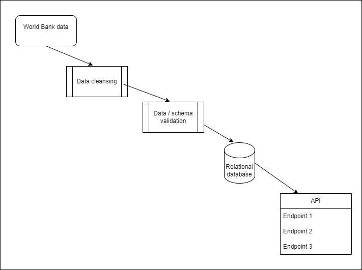

# Project Title: Global data analysis API
Data Analytics Boot Camp - Project 3

## Team members (Group 6)
Kenneth Le, Kurai Monica Matiki, Eric Tran, Greg Presneill

## Project Overview and Rationale
This project aims to provide a reliable, scalable API solution that supports analysts investigating global data statistics and trends over time.

The initial dataset focuses on world population growth. Understanding global population growth is crucial for policy making, economic planning, and resource management. By analysing population data, we help governments, organisations, and researchers to draw insights and make data-driven decisions.

---

# Proposed Solution design

# Implementation notes

For this project, we chose the 'Data Engineering' track.

## Datasets to Be Used
- World Bank population growth dataset
    - https://data.worldbank.org/indicator/SP.POP.GROW?end=2023&name_desc=false&start=2023&view=map&year=2023

## Rough Breakdown of Tasks
1. Extract data (World Bank dataset)
1. Data cleansing
1. Data/schema validation
1. Transform data as required to match database schema
1. Load data into database
1. Design API endpoints
1. Develop queries to allow end users to extract data through the API
1. Summary for presentation.

## Other details
Database choice: relational database (SQL) as we are dealing with tabular data.

Collections: at least two tables are needed
1. Countries: Contains information on countries/continents
2. Population data: Contains historical and current population statistics.

Number of records: The database will have at least 100 records.

ETL Workflow
1. Data extraction – extract raw data from publicly available databases
such as the World Bank datasets available as CSV files or via APIs.
2. Data transformation – Clean and normalise the data to ensure
consistency, convert data measurements to standard units if
needed, add derived fields like growth percentages.
3. Data Load – insert the transformed data into a SQL database.
Data Display
Flask API – develop a Flask API to serve the data in JSON format.
