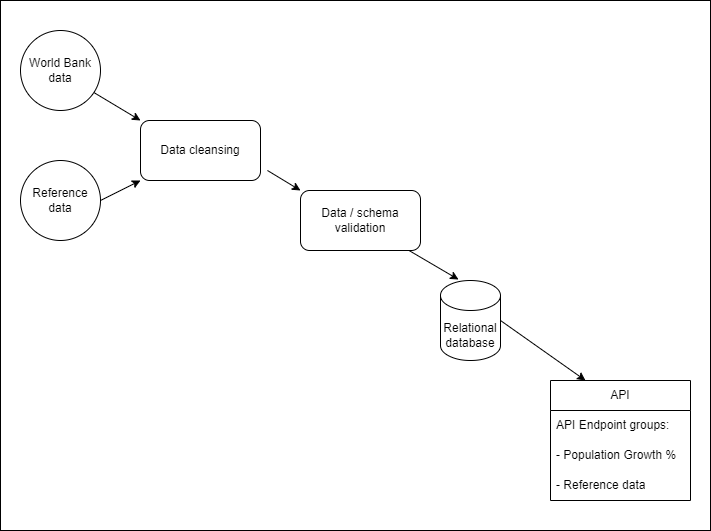
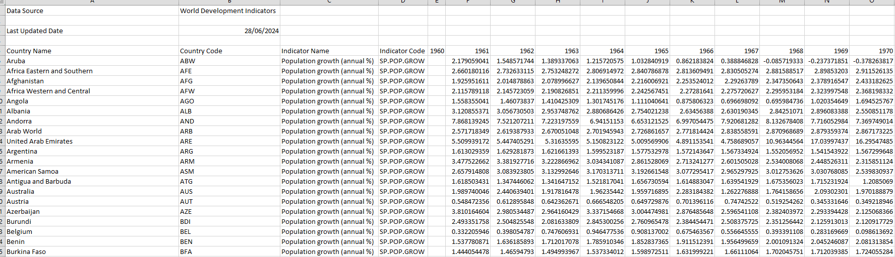
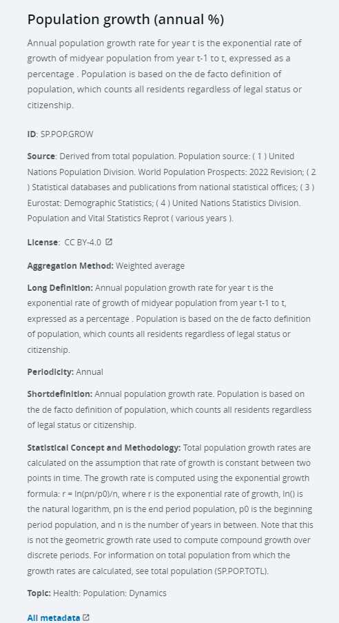

# Project Title: Global data analysis API
Data Analytics Boot Camp - Project 3

## Team members (Group 6)
Kenneth Le, Kurai Monica Matiki, Eric Tran, Greg Presneill

## Results

As well as the source code and database, this repository includes:
- final presentation slides: **slides/PresentationSlides_GlobalDataAnalysisAPI_Group6.pdf**
- a source code example of 'how to use' this project's API for your own further data analysis: **HowToUse_GlobalDataAnalysisAPI_SampleCode.ipynb**

## Steps to Reproduce / How to Run the API

1. Clone this repository.
1. From the top-level repository folder, at a suitable command line (e.g. Bash) invoke `python app.py` to run this project's Flask-based API as a local web server.
1. Note the command line output, which will include the URL for the API (by default this will be http://127.0.0.1:5000).
1. Enter that URL in your browser to see the API landing page.
1. Append one of the API endpoints listed on the landing page to the URL in order to retrieve data from the API (e.g. http://127.0.0.1:5000/api/v1.0/country-codes)
1. Some of the API endpoints require Country Code or Year values to be supplied as part of the URL in order to retrieve the relevant data. You can call other API endpoints to list the available Country Code or Year values, and then choose from those.
1. (Optional) At a second command line, invoke 'jupyter notebook' and open `HowToUse_GlobalDataAnalysisAPI_SampleCode.ipynb` from the top-level repository folder. Update the `server` URL if required (default is again http://127.0.0.1:5000). You can then view the sample code in the Notebook, and run that to query the running Flask-based API.

Assumptions:
- your command-line environment is based on Anaconda or similar, so includes support for the Python environment, and Python libraries used in this project including Flask and Pandera. Installation instructions for Pandera are given below.

Other Notes:
- The project's SQLite database is ready to be queried; it has been saved with the results of the project's ETL phase. In other words, it is not necessary to run the ETL scripts to invoke the API. Having said that, there is additional details below on the ETL phases including steps to recreate the database.

## Project Overview and Rationale
This project aims to provide a reliable, scalable API solution that supports analysts investigating global data statistics and trends over time.

The initial dataset focuses on world population growth. Understanding global population growth is crucial for policy making, economic planning, and resource management. By analysing population data, we help governments, organisations, and researchers to draw insights and make data-driven decisions.

Analysts could use the data to explore questions such as:
1. How has the global population growth rate changed over the past decade?
2. What are the trends in population growth across different continents and countries?
3. Which regions are experiencing the highest and lowest growth rates?
4. How do demographic factors such as age distribution and urbanization rates correlate with population growth patterns?
5. What are the projected population trends for the next few decades?

## Ethical considerations

- Source datasets attribution
    - The primary dataset used was made available by the World Bank Group via the World Bank Open Data site (https://data.worldbank.org/). The dataset's data values were not changed, other than blank values were replaced by '(Not Specified)' indicators in this project's database and output via our API. This change was made to indicate to end users of our API that those data items were not present in the original dataset.
    - The secondary dataset of 'countries by continent' used the downloadable list from the World Population Revew site (https://worldpopulationreview.com/country-rankings/list-of-countries-by-continent) as a basis.
    - The above two datasets were cross-checked and combined using the official list of ISO 3166 Country Codes available from the ISO's Online Browsing Platform (go to https://www.iso.org/obp/ui/#search, click the 'Country codes' radio button, and click Search). ISO allows free-of-charge use of its country, currency and language codes from ISO 3166, ISO 4217 and ISO 639, respectively

- Source datasets (World Bank Group) Terms of Use
    - https://www.worldbank.org/en/about/legal/terms-of-use-for-datasets
    - https://creativecommons.org/licenses/by/4.0/

The project utilizes publicly available, open-source datasets from trusted organizations such as the World Bank. Before incorporating any data into our system, we carefully verify its accuracy, reliability, and alignment with our intended goals, ensuring ethical use of the information.

Copyright and Fair Use:
The datasets have been reviewed to ensure compliance with all relevant copyright protections, specifically adhering to the World Bank’s Creative Commons Attribution 4.0 International (CC BY 4.0) license. This allows the use of the data as long as proper attribution is provided to the World Bank. By following these licensing terms, we maintain respect for the intellectual property rights of data providers and ensure legal use of the data.

Intended Use Documentation:
The intended use of these datasets, both now and in the future, has been clearly documented and aligned with the terms of use provided by the data sources. Our application uses the data for educational and analytical purposes, providing insights into global trends such as population growth, without commercial exploitation. We maintain transparency by documenting how the data is used, shared, and processed, ensuring ongoing compliance with all usage terms.

Data Collection Verification:
We have thoroughly examined the collection process of the datasets to confirm that they were sourced from authorized, legitimate providers. For example, the World Bank dataset is publicly available and compiled from reputable global sources, ensuring ethical sourcing of the data. This investigation ensures that the data is free from ethical concerns related to improper access or unauthorized use.

---

# High-level Solution Design

The API will return JSON data for queries such as:
- List the Countries and Years for which data is available
- Population growth % for all countries by year
- Individual country population growth % by year
- Minimum, Average, and Maximum Population growth % by continent for a specified year.

The following diagram shows the data flow and processing phases leading to the final API.

 

# Implementation notes

For this project, we chose the 'Data Engineering' track.

The additional library used was 'Pandera':
- To install: `pip install pandera`
- To import: `import pandera as pa`

## Datasets to Be Used
- World Bank population growth dataset
    - https://data.worldbank.org/indicator/SP.POP.GROW?end=2023&name_desc=false&start=1961&view=chart&year=2023
    - Sample of source data:
        
    - Metadata:
        

## Rough Breakdown of Tasks
1. Extract data (World Bank dataset)
1. Data cleansing
1. Data/schema validation
1. Transform data as required to match database schema
1. Load data into database
1. Design API endpoints
1. Develop queries to allow end users to extract data through the API
1. Summary for presentation.

## Design / Technology Choices

Database type choice: relational database
- as we are dealing with tabular (structured) data
- also known as 'SQL' database. 

Database product choice: SQLite ( https://www.sqlite.org/ )
- SQLite supports most of the standard SQL language
- SQLite databases are relatively compact files, which makes them suitable for this project, as they are relatively easy to construct and backup.
- SQLite databases are also compatible with Flask (our API technology choice)

### Why Relational Database
1. Structured Data:** Ideal for structured data with a well-defined schema, such as country, year, population count, and other demographic variables.
2. ACID Compliance:** Provides strong transactional integrity with Atomicity, Consistency, Isolation, and Durability, which is critical for ensuring accurate population data.
3. Joins:** Efficiently handles complex queries involving joins, allowing easy integration and analysis of different datasets (e.g., population vs. economic data).
4. Data Integrity:** Robust mechanisms to enforce data integrity through constraints (foreign keys, unique constraints).
5. Standard Query Language (SQL):** Universal and widely understood query language, facilitating analytics, reporting, and integration with various tools.

Database tables: this design implements the following tables
1. CountryContinent: Contains information on countries/continents
2. PopulationGrowth: Contains historical and current population growth percentage statistics.

Number of records: The database will have at least 100 country / population growth records.

## ETL Workflow
ETL Overview
1. Data extraction – extract raw data from publicly available databases
such as the World Bank datasets available as CSV files or via APIs.
2. Data transformation – Clean and normalise the data to ensure
consistency, convert data measurements to standard units if
needed, add derived fields like growth percentages.
3. Data Load – insert the transformed data into a SQL database.
Data Display
Flask API – develop a Flask API to serve the data in JSON format.
